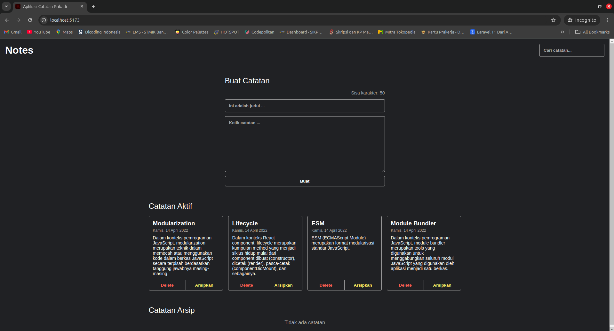

# 📝 Catatan Pribadi

Catatan Pribadi adalah aplikasi berbasis React untuk membuat, menyimpan, mengarsipkan, dan mencari catatan pribadi mereka. Dibuat sebagai project latihan submission di Dicoding, aplikasi ini cocok banget buat lo yang pengen belajar React dan manajemen state! 😎

---

## 🎯 **Fitur**
- Tambah catatan baru 🆕
- Arsipkan atau pindahkan catatan ke daftar aktif 🔄
- Cari catatan berdasarkan judul 🔍
- Hapus catatan yang udah nggak relevan ❌
- Tampilan minimalis dan responsif ✨

---

## 🖼️ **Screenshot**


---
## 🥊 **Coba Langsung**
- https://notes-app-submission-dicoding.vercel.app/

## 🚀 **Cara Install & Jalankan**

### **1. Clone Repo**
Clone dulu repo-nya ke local kamu:
```bash
git clone https://github.com/aldanirayhan/notes-app-submission-dicoding.git
cd notes-app-submission-dicoding
```

### **2. Install Dependencies**
Install semua dependency yang dibutuhkan dengan npm :
```bash
npm install
```

### **3. Jalankan Aplikasi**
Start aplikasi lokal:
```bash
npm run dev
```

Buka browser dan akses:  
[http://localhost:5173](http://localhost:5173)

---

## 📚 **Cara Pakai**
1. **Tambah Catatan**  
   Isi judul dan deskripsi catatan, lalu klik "Buat".  
2. **Arsipkan Catatan**  
   Klik tombol "Arsipkan" untuk memindahkan catatan ke daftar arsip.  
3. **Cari Catatan**  
   Ketik kata kunci di search bar untuk cari catatan yang relevan.  
4. **Hapus Catatan**  
   Klik tombol "Delete" untuk menghapus catatan yang nggak dibutuhin.  

---

## 👨‍💻 **Tech Stack**
- **React.js**: Library untuk membangun UI interaktif.
- **CSS**: Untuk styling aplikasi.
- **Local State Management**: Mengelola data catatan tanpa backend.  

---


**Dibuat dengan ❤️ oleh [Rayhan Aldani](https://github.com/aldanirayhan)**  
